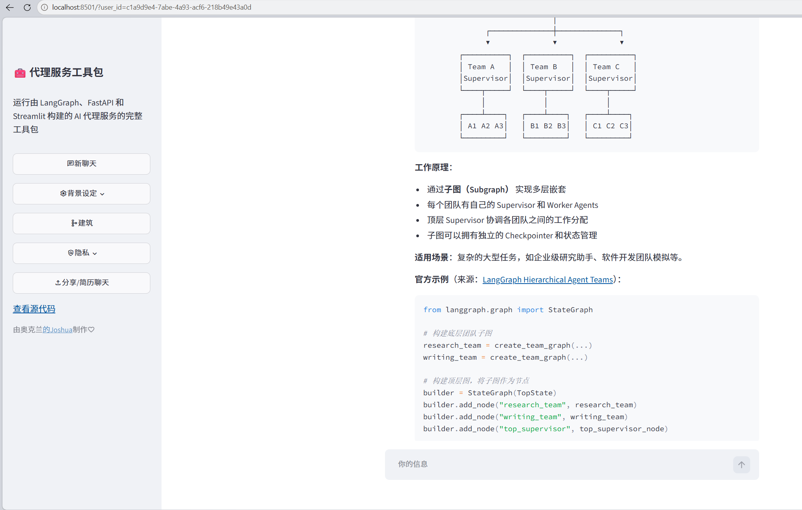
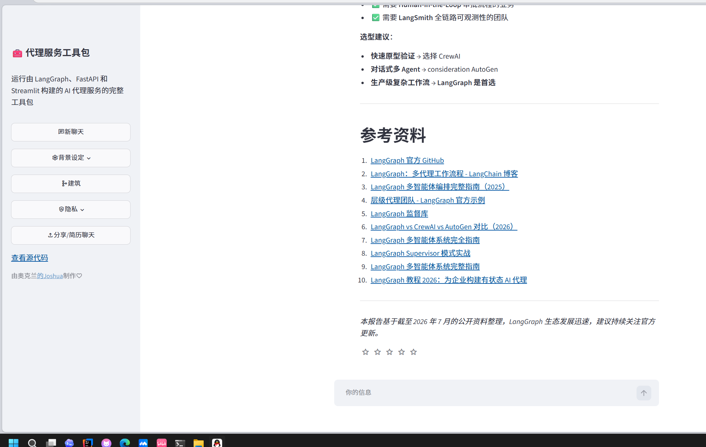

# Tech Research Agent

一个基于 LangGraph、FastAPI、Streamlit 和 DeepSeek API 构建的技术调研报告 Agent 项目。

本项目基于 `agent-service-toolkit` 进行二次开发，新增了一个自定义 Agent：`tech-research-agent`。  
该 Agent 可以根据用户输入的技术主题，自动进行信息检索、内容分析，并生成结构化的中文技术调研报告。

---

## 1. 项目简介

Tech Research Agent 是一个面向技术学习、行业调研和方案分析的 AI Agent 应用。

用户输入一个技术主题后，系统会调用大语言模型和搜索工具，按照固定的技术调研报告结构输出内容，包括：

- 背景
- 核心概念
- 当前应用场景
- 技术实现思路
- 优势与局限
- 发展趋势
- 总结建议

示例问题：

```text
请调研一下 LangGraph 在多 Agent 系统中的应用，并生成一份技术调研报告
```

---

## 2. 核心功能

### 2.1 技术调研报告生成

用户输入技术主题后，Agent 会生成结构化报告，适合用于：

- 技术学习
- 行业分析
- 项目选型
- 面试准备
- 技术博客初稿

### 2.2 WebSearch 工具调用

项目集成 WebSearch 工具，用于辅助检索技术资料和最新信息。

为了提高稳定性，本项目对搜索工具进行了安全封装。即使搜索失败，Agent 也会返回明确提示，而不是直接导致后端服务异常。

### 2.3 DeepSeek 模型接入

项目使用 DeepSeek API 作为大语言模型服务。

通过 `.env` 文件配置：

```env
DEEPSEEK_API_KEY=your_api_key
DEFAULT_MODEL=deepseek-chat
USE_FAKE_MODEL=false
```

### 2.4 前后端分离

项目包含：

- FastAPI 后端服务
- Streamlit 前端页面
- LangGraph Agent 工作流
- API 接口文档页面

---

## 3. 技术栈

| 模块 | 技术 |
|---|---|
| Agent 框架 | LangGraph |
| 后端服务 | FastAPI |
| 前端页面 | Streamlit |
| 大语言模型 | DeepSeek API |
| 工具调用 | LangChain Tools / DDGS |
| 包管理 | uv |
| 版本管理 | Git |
| 配置管理 | dotenv |
| 部署支持 | Docker / Docker Compose |

---

## 4. 项目结构

```text
agent-service-toolkit/
├── src/
│   ├── agents/
│   │   ├── agents.py
│   │   ├── research_assistant.py
│   │   └── tech_research_agent.py
│   ├── service/
│   ├── streamlit_app.py
│   └── run_service.py
├── tests/
├── docs/
│   └── images/
│       ├── frontend-home.png
│       └── tech-report-output.png
├── .env.example
├── pyproject.toml
├── uv.lock
├── compose.yaml
└── README.md
```

关键文件说明：

| 文件 | 说明 |
|---|---|
| `src/agents/tech_research_agent.py` | 自定义技术调研报告 Agent |
| `src/agents/agents.py` | Agent 注册入口 |
| `src/run_service.py` | FastAPI 后端启动入口 |
| `src/streamlit_app.py` | Streamlit 前端启动入口 |
| `.env` | 本地环境变量配置文件 |

---

## 5. 自定义 Agent 说明

本项目新增了：

```text
tech-research-agent
```

该 Agent 的目标是生成结构化技术调研报告。

默认输出结构：

```text
1. 背景
2. 核心概念
3. 当前应用场景
4. 技术实现思路
5. 优势与局限
6. 发展趋势
7. 总结建议
```

在 `src/agents/agents.py` 中注册：

```python
"tech-research-agent": Agent(
    description="A technical research report agent with web search and structured analysis.",
    graph_like=tech_research_agent,
)
```

并设置为默认 Agent：

```python
DEFAULT_AGENT = "tech-research-agent"
```

---

## 6. 运行方式

### 6.1 克隆项目

```powershell
git clone https://github.com/hyyyds123hy/tech-research-agent.git
cd tech-research-agent
```

### 6.2 安装依赖

```powershell
uv sync --frozen
```

### 6.3 激活虚拟环境

Windows PowerShell：

```powershell
.\.venv\Scripts\Activate.ps1
```

### 6.4 配置环境变量

复制 `.env.example` 为 `.env`，然后填写 DeepSeek 配置：

```env
DEEPSEEK_API_KEY=your_api_key
DEFAULT_MODEL=deepseek-chat
USE_FAKE_MODEL=false
HOST=127.0.0.1
PORT=8000
AGENT_URL=http://localhost:8000
```

注意：不要把真实 API Key 提交到 GitHub。

### 6.5 启动后端服务

```powershell
$env:HOST="127.0.0.1"
$env:PORT="8000"
$env:AGENT_URL="http://localhost:8000"

python src/run_service.py
```

后端服务地址：

```text
http://localhost:8000
```

API 信息页面：

```text
http://localhost:8000/info
```

API 文档页面：

```text
http://localhost:8000/docs
```

### 6.6 启动前端页面

新开一个 PowerShell 窗口：

```powershell
cd tech-research-agent
.\.venv\Scripts\Activate.ps1
$env:AGENT_URL="http://localhost:8000"

streamlit run src\streamlit_app.py
```

前端页面地址：

```text
http://localhost:8501
```

---

## 7. 使用示例

输入：

```text
请调研一下 AI Agent 在企业自动化办公中的应用场景，并生成一份技术调研报告
```

输出结构：

```markdown
# 技术调研报告：AI Agent 在企业自动化办公中的应用场景

## 1. 背景

## 2. 核心概念

## 3. 当前应用场景

## 4. 技术实现思路

## 5. 优势与局限

## 6. 发展趋势

## 7. 总结建议
```

---

## 8. 项目截图

### 前端页面



### Agent 输出示例



---

## 9. 开发记录

本项目使用 Git 分支进行开发：

```text
feature/tech-research-agent
```

关键提交记录：

```text
feat: customize research assistant prompt for technical reports
feat: add tech research report agent
docs: update README for tech research agent
docs: add project screenshots
```

版本标签：

```text
v0.1-tech-research-agent
```

---

## 10. 已解决问题

### 10.1 Git 环境问题

解决了 Windows PowerShell 中无法识别 `git` 命令的问题。

### 10.2 Python 依赖问题

使用 `uv sync --frozen` 安装项目依赖。

### 10.3 DeepSeek API 配置问题

通过 `.env` 配置 DeepSeek API Key 和默认模型。

### 10.4 端口占用问题

将后端端口调整为：

```env
PORT=8000
```

并使用：

```powershell
netstat -ano | findstr :8000
```

排查端口占用。

### 10.5 WebSearch 稳定性问题

对搜索工具进行了安全封装，避免搜索失败导致整个 Agent 服务异常。

---

## 11. 后续规划

后续可以继续增强：

- 增加 Reviewer 节点，对报告质量进行检查
- 增加多 Agent 协作流程
- 增加报告导出功能
- 增加历史会话管理
- 增加 Docker 部署说明
- 增加自动化测试和评估指标
- 优化前端页面展示效果

---

## 12. 项目价值

本项目体现了以下能力：

- 使用 LangGraph 构建 Agent 工作流
- 使用 FastAPI 提供后端 API 服务
- 使用 Streamlit 构建可交互前端
- 接入 DeepSeek 大语言模型
- 实现工具调用和异常处理
- 使用 Git 进行分支开发和版本管理
- 将开源模板改造成可展示的个人 AI Agent 项目
